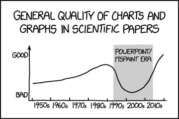

# Student Information

**Course:** COMP90054 AI Planning for Autonomy

**Semester:** Semester 1, 2023

**Student:**

Arya Araban - 1439683 - AARABAN

> Replace the lines above with your correct details. Your student number should only be the **numbers**. For example: Guang Hu - 000000 - ghu1. 

**Collaborated With:**

> If you worked with another student, please include their **full name** and ask them to provide you with the **url to their github codebase**. Their codebase should be private, you will not have access to the code, so there's no issue with knowing their URL, e.g. Collaborated with: Lionel Messi - URL: github.com/what-a-worldcup.

# Self Evaluation

>**Note**
> Do not exceed 500 words for each Part. This is indicative, no need to have 500 words, and it's not a strict limit.

## Part 1
#### Self Evaluated Marks (3 marks):
3

> Please replace the above 0 with the mark you think you earned for this part. Consider how many (yours/ours) tests pass, the quality of your code, what you learnt, and [mainly for the final task] the quality of the tests that you wrote
#### Code Performance
This graph is just an example of how you can include your plots in markdown.

> Please explain the code performance of your solution. You can create a video, include figures, tables, etc. Make sure to complement them with text explaining the performance.

Here are some examples for the performance of my implementation of EHC: 

layout: smallMaze -- total cost: 39-- search nodes expanded: 114

layout: mediumMaze -- total cost: 76-- search nodes expanded: 151

layout: bigMaze -- total cost: 246 -- search nodes expanded: 720

The problem with this method is that it cannot guarantee optimality at all, since it is a local-search method.  it is worth noting that in EHC after finding a node better than the current one using a BFS manner, all the other considered paths are erased from memory, allowing for the system to have more free RAM compared to normal HC.  The other detail that can be pointed out here is that since HC algorithms do not need to define the search space explicitly, the goal_node (or goal_nodes) do not need to be known before-hand.

#### Learning and Challenges
> Please include your top lessons learnt, and challenges faced.

Before I started implementing this algorithm, I spent some of my time searching on how EHC can be implemented and got rather confused on exactly what it is I should be doing. After which I did try to implement EHC, but quickly got stuck. That's when I finally decided to go back and watch the lecture video explaining EHC, and it all clicked for me. I found the pseudo-code to also be very helpful in guiding how I should be implementing the algorithm

#### Ideas That Almost Worked Well

> If you tried ideas that did not make it to the final code, please include them here and explain why they didn't make it.

#### Justification

> Please state the reason why you have assigned yourself these marks.

I believe I've got a good grasp on the key ideas surrounding EHC after implementing it for myself and having all of the sanity checks for the assignment passing. 

#### New Tests Shared @ ED

> Tell us about your testcases and why were they useful

## Part 2
#### Self Evaluated Marks (3 marks):
3

> Please replace the above 0 with the mark you think you earned for this part. Consider how many (yours/ours) tests pass, the quality of your code, what you learnt, and [mainly for the final task] the quality of the tests that you wrote.
#### Code Performance

> Please explain the code performance of your solution. You can create a video, include figures, tables, etc. Make sure to complement them with text explaining the performance.

Here are some examples of executing BAE* using my implementation: 

layout: smallMaze -- total cost: 19-- search nodes expanded: 38

layout: mediumMaze -- total cost: 68 -- search nodes expanded: 185

layout: bigMaze -- total cost: 210 -- search nodes expanded: 571

Generally speaking, the informed search algorithm known as A*  will give the optimal result as long as the selected heuristic is admissible. This holds true for BAE* ( which is a bidirectional implementation of A* ). It is worth noting , even if the heuristic is not admissible, it can still give rather good results. For example, even though the Manhattan distance heuristic is NOT admissible for Pac-Man, it is apparent that we are getting much lower cost results compared to the results we previously obtained with EHC, meaning the results from BAE* are closer to optimal. 

#### Learning and Challenges
> Please include your top lessons learnt, and challenges faced. 

The problem I faced yet again was trying to implement this algorithm without entirely understanding how it works. Even though I did read through the info provided in the Readme file, and almost felt like I understood it, I still had some questions regarding how this should be implemented, especially the parts involved in specifying the b_value for created successors, as well as how the direction X is chosen. I tried to implement BAE* with the pseudo code provided, but noticed I was running into errors and bugs in my code. At this point I carefully read through the original paper and paid extra attention to the provided formulas, up until I felt confident enough in my knowledge to continue coding. This resulted in me understanding every step of the process and my code being able to pass all the sanity checks. 

it is worth noting here that one major challenge I faced while coding this part, was searching for the current state inside the opposite side priority queue, but after some trial-and-error I found out a way to do this in a quiet efficient manner. I realized that I can extract the nodes from the opposite side priority queue, store them in a list, and then compare the current_state to each of the states of the nodes of the opposite queue. 

#### Ideas That Almost Worked Well

> If you tried ideas that did not make it to the final code, please include them here and explain why they didn't make it.

#### New Tests Shared @ ED

> Tell us about your testcases and why were they useful

#### Justification

> Please state the reason why you have assigned yourself these marks.

After all the challenges I faced in order to finish this part of the assignment, I felt like I completely understood how BAE* works and was very thrilled to be able to pass all the sanity checks.

## Part 3
#### Self Evaluated Marks (4 marks):
4

> Please replace the above 0 with the mark you think you earned for this part. Consider how many (yours/ours) tests pass, the quality of your code, what you learnt, and [mainly for the final task] the quality of the tests that you wrote
#### Code Performance

> Please explain the code performance of your solution. You can create a video, include figures, tables, etc. Make sure to complement them with text explaining the performance.

The problem formulation here is quiet different than what we had in the previous two parts. In this part of the assignment, There are multiple foods in which Pac-Man must eat in order to complete the search. This can be more challenging compared to the previous two parts, since we must consider multiple goal states for our search.  

The following are some of the results I got from executing my code on different search layouts: 

layout: smallCorners -- search nodes expanded: 525 -- score: 459

layout: mediumCorners -- search nodes expanded: 678 -- score: 411

layout: trickySearch-- search nodes expanded: 1306 -- score: 570

It must be pointed out that there are a few parameters which I handpick that effect the number of nodes expanded. 

As an example, in my initial implementation I had the cost of each move to be 1, however I realized this can be modified based on heuristics. For example if Pac-man is getting closer the the closest food to him, the move cost can be set to be lower than 1, which I've set to be 0.75. Changing these parameters can greatly reduce the number of nodes expanded, however, they may also not allow the optimal path to be discovered.

#### Learning and Challenges
> Please include your top lessons learnt, and challenges faced.  

Before saying anything else, I must say that this was some of the most fun I've ever had while programming! 

I really liked this part of the assignment since it encouraged us to come up with our ideas and also dive deeper into Berkley's Pac-Man code. 

At first when trying to solve this problem, I thought about how I can formulate the states in a suitable manner so that we have a clearly defined start-state, and clearly defined goal-states, which are reachable from one another (since BAE* is used here). What I came up with was that each state should contain the current location of Pac-Man, as well as the current food grid. 

This food grid generally contains 'T' for food locations, and 'F' for where no food exists. However in order to mark a food as being already eaten by Pac-Man, I added the extra label 'e'. This means that the food grid of each of the goal states will have no 'T' in them, and only have 'e' and 'F', with Pac-Man's location being on one of the 'e' positions. 

One main challenge I had was with making sure I formulate the getSuccessors function correctly, specifically the part where I had to check if the successor direction would move into a 'T' position, thus converting it into 'e'. 

after implementing that function, wrapping my head around exactly how getBackwardsSuccessors would work was quiet challenging. in the end, I opted for the classic paper-and-pencil approach to understand exactly what I needed to change compared to the previous function. 

#### Ideas That Almost Worked Well

> If you tried ideas that did not make it to the final code, please include them here and explain why they didn't make it.

Up until this point, heuristics weren't the mix yet. My current implementation would get 2/4 of the sanity checks correct. This is where I would try all sorts of different heuristics. At first I tried using the Manhattan distance heuristic in such a way that the forward heuristic was the distance between Pac-Man and the food closest to it, and the backwards heuristic was the Manhattan distance between Pac-Man and the start state. This didn't turn out well and the code was still only passing 2 of the checks.  After trying various different possible heuristics, I managed to implement the forward and backward heuristics which would pass 3/4 of the tests! This heuristic would calculate the Manhattan distance between the two farthest food palettes, as well as the Manhattan distance between Pacman and the closer one of the two, and would finally sum up these values. From here I tried mixing up heuristics to pass that final test-case, but unfortunately couldn't get it.

#### Justification

> Please state the reason why you have assigned yourself these marks.

I managed to formulate this problem in a suitable manner and implement all of the related functions given this formulation I came up with. For the heuristics, I studied various different heuristics which can be used in Pac-Man and tried my best to implement a solution that will almost always be optimal. I managed to get really close to this goal, only failing one test3 of the sanity tests. Overall, I put a lot of energy into this part of the assignment I believe I deserve to get the full mark for getting very close to the perfect solution. 

Thank you!

#### New Tests Shared @ ED

> Tell us about your testcases and why were they useful